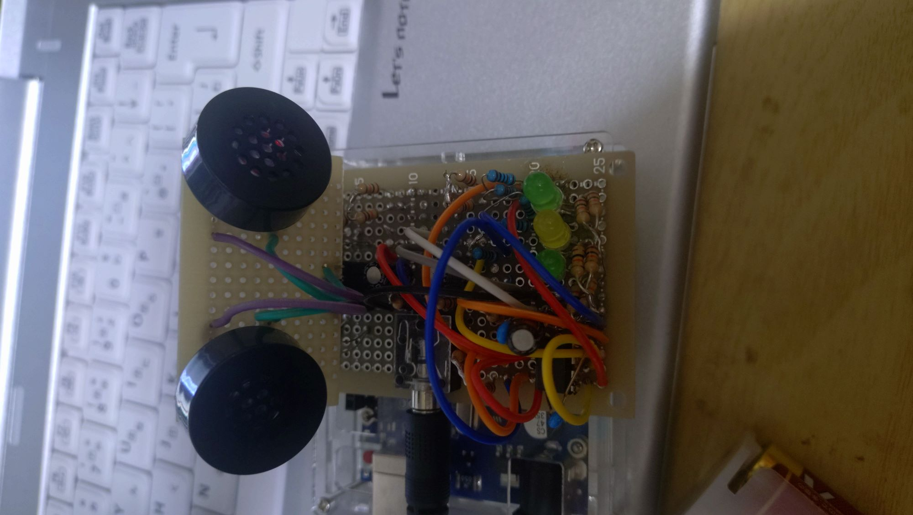

# Arduino Stereo Audio Input Experiments

Exploring stereo audio input and analog circuits with Arduino.  
This project has been successfully completed, resulting in a stable and well‑documented stereo input system.

## What this project is about
- Stereo analog input experiments
- Op-amp buffering and impedance matching
- Noise reduction and ADC behavior
- DIY audio signal path design
- Final successful implementation of a clean, separated stereo input path
- 
## Folder Structure
- `/circuit/` : Circuit diagrams and notes
- `/src/` : Arduino code
- `/notes/` : Experiment logs and observations

## Circuit Photos

### Work in Progress

### Final Circuit

## Author (I have a video of the finished product)
https://x.com/mmmmmm999i56897
